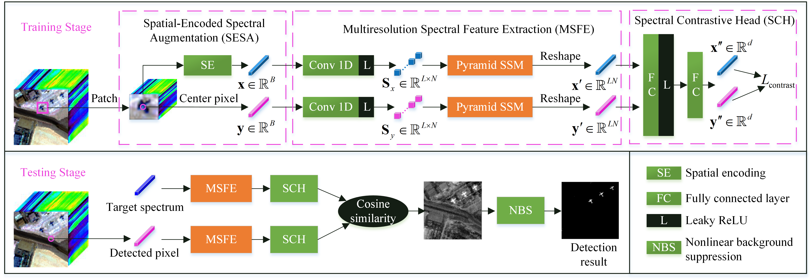

<div align="center">
<h1>HTD-Mamba </h1>
<h3>Efficient Hyperspectral Target Detection with Pyramid State Space Model</h3>

[Dunbin Shen](https://scholar.google.com/citations?user=DH4VSLMAAAAJ&hl=zh-CN)<sup>1</sup> ,[Xuanbing Zhu](https://github.com/ZHU-0108/FCNet-main)<sup>1</sup> ,Jiacheng Tian<sup>1</sup>, [Jianjun Liu](https://scholar.google.com/citations?user=RfDuPkwAAAAJ&hl=zh-CN)<sup>2</sup>, [Zhenrong Du](https://scholar.google.com/citations?user=QIcuvuYAAAAJ&hl=zh-CN&oi=ao)<sup>1</sup>, [Hongyu Wang](http://faculty.dlut.edu.cn/MMCL_WHY/zh_CN/)<sup>1</sup>, [Xiaorui Ma](https://scholar.google.com/citations?hl=zh-CN&user=bM2EAnMAAAAJ)<sup>1 :email:</sup>

<sup>1</sup>  Dalian University of Technology, <sup>2</sup>  Jiangnan University

(<sup>:email:</sup>) Corresponding author.

ArXiv Preprint ([arXiv 2407.06841](https://arxiv.org/abs/2407.06841))


</div>


#


### News
* **` March 3th, 2025`:** Our paper has been published to IEEE Explore.️
* **` July 18th, 2024`:** We released our codes and models.️


## Abstract
Hyperspectral target detection (HTD) identifies objects of interest from complex backgrounds at the pixel level, playing a vital role in Earth observation. However, the limited target priors constrain the ability to obtain sufficient features or patterns for background-target discrimination, and spectral variation further exacerbates the difficulty of achieving reliable and robust performance. To address these challenges, this paper proposes an efficient self-supervised HTD method with a pyramid state space model (SSM), named HTD-Mamba, which employs spectrally contrastive learning to distinguish between target and background based on the similarity measurement of intrinsic features. Specifically, to obtain sufficient training samples and leverage spatial contextual information, we propose a spatial-encoded spectral augmentation technique that encodes all surrounding pixels within a patch into a transformed view of the center pixel. Additionally, to explore global band correlations, we divide pixels into continuous group-wise spectral embeddings and introduce Mamba to HTD for the first time to model long-range dependencies of the spectral sequence with linear complexity. Furthermore, to alleviate spectral variation and enhance robust representation, we propose a pyramid SSM as a backbone to capture and fuse multiresolution spectral-wise intrinsic features. Extensive experiments conducted on four public datasets demonstrate that the proposed method outperforms state-of-the-art methods in both quantitative and qualitative evaluations.

## Overview
<div align="center">

</div>

## Installation
- CUDA 11.7
  - Make sure `/usr/local/cuda-11.7` exists. If not, you can install it from NVIDIA DEVELOPER ([CUDA Toolkit](https://developer.nvidia.com/cuda-toolkit-archive)). For example, Ubuntu 18.04 x86_64
    - `wget https://developer.download.nvidia.com/compute/cuda/11.7.1/local_installers/cuda_11.7.1_515.65.01_linux.run`
    - `sudo sh cuda_11.7.1_515.65.01_linux.run`
  
    Note that if you use Ubuntu 24.04, perhaps the gcc version is too high to install CUDA 11.7. So you should degrade the gcc version at first like this:
    - `sudo apt install gcc-9 g++-9`
    - `sudo update-alternatives --install /usr/bin/gcc gcc /usr/bin/gcc-9 100 `
    - `gcc -v`
  - See `nvcc -V` is `cuda_11.7`. If not, you should modify the `.bashrc` like this:
    - `vim ~/.bashrc` -> `i`, and add the following to the end
    
      export CUDA_HOME=/usr/local/cuda-11.7
    
      export PATH=$PATH:/usr/bin:/bin
    
      export PATH=/usr/local/cuda-11.7/bin${PATH:+:${PATH}}
    
      export LD_LIBRARY_PATH=/usr/local/cuda-11.7/lib64${LD_LIBRARY_PATH:+:${LD_LIBRARY_PATH}}
    - `esc`->`:wq`->`source ~/.bashrc`, and see `nvcc -V` is `cuda_11.7`.
- Python 3.10.x
  - `conda create -n htd-mamba python=3.10`
  - `conda activate htd-mamba`

- Torch 2.0.1
  - `conda install pytorch==2.0.1 torchvision==0.15.2 torchaudio==2.0.2 pytorch-cuda=11.7 -c pytorch -c nvidia` or
  - `pip install torch==2.0.1 torchvision==0.15.2 torchaudio==2.0.2 --index-url https://download.pytorch.org/whl/cu117`

- Requirements: requirements.txt
  - `cd /home/your_path/HTD-Mamba-main`
  - `pip install -r requirements.txt`

- Install ``selective_scan_cuda``
  - `cd /home/your_path/HTD-Mamba-main`
  - `pip install .`
  
- Install ``causal_conv1d``
  - `pip install --upgrade pip`
  - `pip install causal_conv1d>=1.1.0`
 
## Evaluation
To evaluate `HTD-Mamba` on four public datasets, run:
```bash
CL_Main_Sandiego.py  
CL_Main_Sandiego2.py
CL_Main_LosAngeles.py
CL_Main_Pavia.py
```
## Training
- To train `HTD-Mamba`, change the state to `train`. After training, you can use the state `select_best` to select the best model from all epochs.
- To train `HTD-Mamba` on a new dataset, update the `dataset`, `path`, and `band`. For optimal performance, fine-tune parameters such as `patch_size`, `m`(group length), and `channel`(embedding size).  
## Acknowledgement
This project is based on `Mamba` ([paper](https://arxiv.org/abs/2312.00752), [code](https://github.com/state-spaces/mamba)), `Vim` ([paper](https://arxiv.org/abs/2401.09417), [code](https://github.com/hustvl/Vim)). We thank the authors for their promising studies.


## Citation
If you find `HTD-Mamba` useful in your research or applications, please consider giving us a star 🌟 and citing it using the following BibTeX entry.

```bibtex
 @article{shen2024htd,
  title={HTD-Mamba: Efficient Hyperspectral Target Detection with Pyramid State Space Model},
  author={Shen, Dunbin and Zhu, Xuanbing and Tian, Jiacheng and Liu, Jianjun and Du, Zhenrong and Wang, Hongyu and Ma, Xiaorui},
  journal={IEEE Transactions on Geoscience and Remote Sensing},
  doi={10.1109/TGRS.2025.3547019},
  year={2025}
}
```
